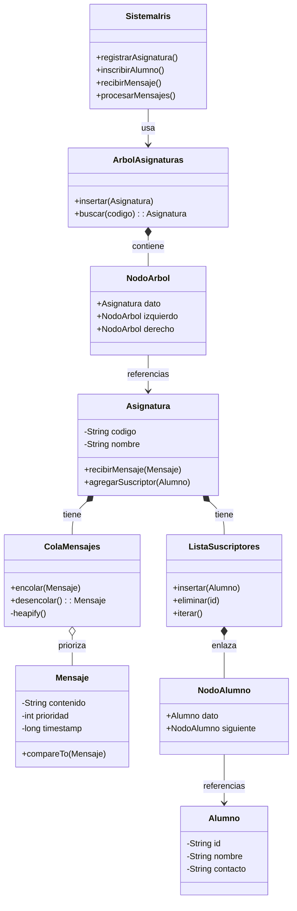

# Reto 006: Estructuras de Datos para Iris

Propuesta de diseño de estructuras de datos para el sistema **Iris**, un redirector de mensajes estructurados que captura envíos, los resume mediante IA y los notifica a los suscriptores vía WhatsApp.

## 1. Diagramas UML

### Diagrama de Clases (Estructuras de Datos)

El sistema utiliza estructuras personalizadas para optimizar el rendimiento:
- **BST (Árbol Binario)** para Búsqueda rápida de Asignaturas.
- **Max-Heap (Cola Prioridad)** para gestión de Mensajes Urgentes.
- **Linked List (Lista Enlazada)** para iteración de Suscriptores.



### Diagrama de Flujo de Datos

```mermaid
graph TD
    Input[Entrada Mensaje] -->|Extraer Código| Iris{Sistema Iris}
    Iris -->|Buscar Asignatura (BST, O log N)| Asig[Nodo Asignatura]
    
    subgraph Asignatura Node
        Asig -->|Encolar| PQ[Cola de Prioridad (Heap)]
        PQ -->|Desencolar (Mayor Prio)| Proc[Procesador IA]
    end
    
    Proc -->|Resumen| Notif[Notificador]
    Notif -->|Iterar Suscriptores (Lista)| Subs[Lista Enlazada Alumnos]
    Subs -->|Fan-out| WA[API WhatsApp]
```

## 2. Justificación de las Estructuras

| Operación | Estructura Elegida | Justificación | Eficiencia (Big O) |
|-----------|--------------------|---------------|-------------------|
| **Identificar Asignatura** | **Árbol Binario de Búsqueda (BST)** | Permite buscar asignaturas por código más rápido que una lista secuencial. Mantiene el orden alfabético. | **O(log N)** (promedio) |
| **Gestionar Suscripciones** | **Lista Enlazada (con validación Set)** | Garantiza unicidad al insertar (previo chequeo) y permite recorrer secuencialmente para el envío masivo. | **O(1)** insert/delete (si tenemos ref) / **O(N)** scan |
| **Cola de Mensajes** | **Cola de Prioridad (Max-Heap)** | Asegura que los mensajes urgentes se procesen antes, independientemente del orden de llegada. Desacopla recepción de envío. | **O(log M)** encolar/desencolar |
| **Envío Masivo** | **Lista Enlazada** | Optimiza el recorrido secuencial necesario para notificar a todos los alumnos uno por uno. | **O(K)** iteración total |

## 3. Compromisos y Trade-offs

1.  **Consumo de Memoria vs Rapidez**: Usamos estructuras de nodos (BST, Listas) que consumen más RAM por punteros, aceptable dado el volumen (<1000 asignaturas).
2.  **Latencia**: Las colas introducen un retraso intencional para evitar saturar la API de WhatsApp ("Aplanamiento de curva de tráfico").
3.  **Complejidad**: Mantener un Árbol y Heaps es más complejo que usar Arrays simples, pero escala mejor bajo carga.

## 4. Casos Límite

- **Asignatura Desconocida**: Si el BST devuelve `null`, el mensaje se loguea como "No categorizado" y se descarta.
- **Sin Suscriptores**: Si la lista está vacía, el proceso se detiene antes de llamar a la IA, ahorrando costes.
- **Bajas (Borrado)**: Al darse de baja, se busca en la lista enlazada (O(K)) y se elimina el nodo.
- **Empate de Prioridad**: El Heap utiliza el `timestamp` como criterio de desempate (FIFO para misma prioridad).
