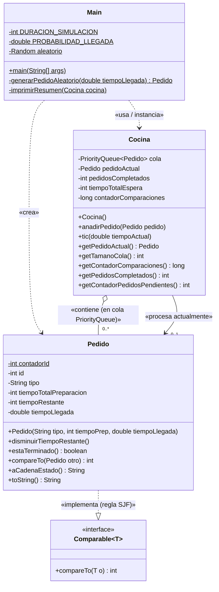

```mermaid
classDiagram
    %% Definición de clases y sus miembros
    class Main {
        %% Campos estáticos (subrayados en UML estándar, con $ en Mermaid)
        -int DURACION_SIMULACION$
        -double PROBABILIDAD_LLEGADA$
        -Random aleatorio$
        %% Métodos estáticos
        +main(String[] args)$
        -generarPedidoAleatorio(double tiempoLlegada)$ Pedido
        -imprimirResumen(Cocina cocina)$
    }

    class Cocina {
        %% Estado interno de la cocina
        -PriorityQueue~Pedido~ cola
        -Pedido pedidoActual
        -int pedidosCompletados
        -int tiempoTotalEspera
        -long contadorComparaciones
        %% Constructor y lógica de negocio
        +Cocina()
        +anadirPedido(Pedido pedido)
        +tic(double tiempoActual)
        %% Getters para estadísticas
        +getPedidoActual() Pedido
        +getTamanoCola() int
        +getContadorComparaciones() long
        +getPedidosCompletados() int
        +getContadorPedidosPendientes() int
    }

    class Pedido {
        %% Campos estáticos y de instancia
        -int contadorId$
        -int id
        -String tipo
        -int tiempoTotalPreparacion
        -int tiempoRestante
        -double tiempoLlegada
        %% Constructor y métodos de dominio
        +Pedido(String tipo, int tiempoPrep, double tiempoLlegada)
        +disminuirTiempoRestante()
        +estaTerminado() boolean
        %% Método clave para la PriorityQueue
        +compareTo(Pedido otro) int
        +aCadenaEstado() String
        +toString() String
    }

    %% Interfaz estándar de Java
    class Comparable~T~ {
        <<interface>>
        +compareTo(T o) int
    }

    %% --- Relaciones entre clases ---

    %% Main depende de Cocina y Pedido para funcionar (Dependencia)
    Main ..> Cocina : «usa / instancia»
    Main ..> Pedido : «crea»

    %% Cocina tiene una colección de Pedidos (Agregación)
    Cocina o-- "0..*" Pedido : «contiene (en cola PriorityQueue)»
    %% Cocina también tiene una referencia al pedido actual
    Cocina --> "0..1" Pedido : «procesa actualmente»

    %% Pedido implementa la interfaz Comparable (Realización)
    Pedido ..|> Comparable : «implementa (regla SJF)»
```
