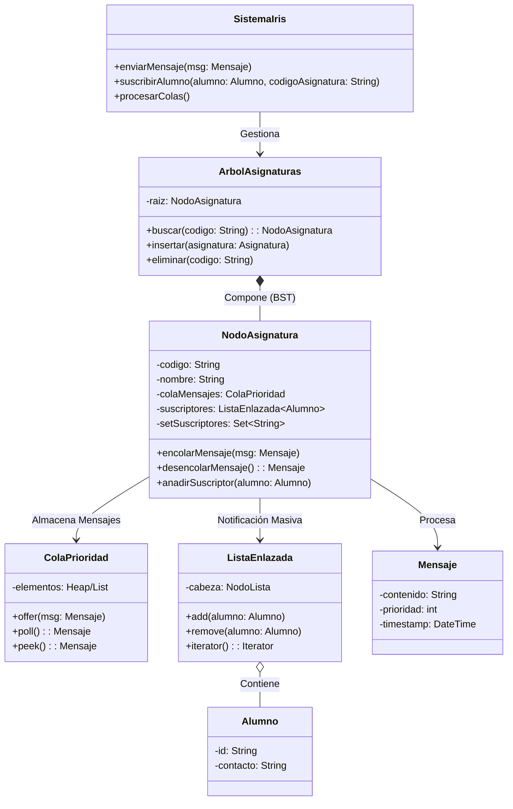

# Reto 006: Estructuras de Datos para Iris

Esta propuesta detalla el diseño de las estructuras de datos para el sistema **Iris**, un redirector de mensajes estructurados que captura envíos, los resume mediante IA y los notifica a los suscriptores vía WhatsApp.

## 1. Diagramas UML

### Diagrama de Clases (Estructuras de Datos)

El siguiente diagrama detalla cómo el sistema central indexa la información para un acceso rápido y cómo se relacionan las entidades.



### Diagrama de Componentes y Flujo de Datos

Visualización del flujo de la información a través de las estructuras propuestas.

```mermaid
graph TD
    Emisor[Emisor (Profesor)] -->|Envía Mensaje| Input[Receptor Entrada]
    
    subgraph "Estructura de Datos (Memoria)"
        Input -->|Busca Asignatura| BST{BST: Búsqueda Logarítmica}
        BST -->|Encontrada| Node[Nodo Asignatura]
        
        Node -->|Encola| PQ[Cola de Prioridad]
    end
    
    subgraph "Procesamiento Asíncrono"
        Worker[Worker / Cron] -->|Extrae Prioritario| PQ
        PQ -->|Mensaje| IA[Servicio IA (Resumen)]
        IA -->|Resumen| Sender[Motor de Envío]
    end
    
    subgraph "Fan-out / Distribución"
        Sender -->|Itera| List[Lista Enlazada Suscriptores]
        List -->|Notifica| WA[WhatsApp API]
        List -->|Notifica| Email[Servicio Email]
    end

    style BST fill:#f9f,stroke:#333
    style PQ fill:#dfd,stroke:#333
    style List fill:#bbf,stroke:#333
```

## 2. Justificación de las Estructuras

Se han seleccionado estructuras específicas para garantizar la eficiencia algorítmica (Notación Big O) en cada fase del proceso.

| Operación | Estructura Elegida | Justificación (Por qué) |
| :--- | :--- | :--- |
| **Identificar Asignatura** | **Árbol Binario de Búsqueda (BST)** | **Eficiencia Logarítmica**. Aunque no es instantáneo, un árbol permite encontrar una asignatura en tiempo logarítmico **O(log n)**. Es mucho más rápido que recorrer una lista (O(n)) y nos permite mantener el catálogo de asignaturas ordenado alfabéticamente si fuera necesario listar. |
| **Gestionar Suscripciones** | **Conjunto (Set)** | **Unicidad**. Un Set garantiza matemáticamente que un alumno no se suscriba dos veces a la misma asignatura y permite verificar la existencia de una suscripción en tiempo constante **O(1)**. |
| **Cola de Mensajes** | **Cola de Prioridad** | **Orden y Urgencia**. Desacopla la recepción del procesamiento para manejar picos de tráfico sin saturar los servicios externos (IA/WhatsApp). La prioridad asegura que mensajes urgentes se procesen antes. |
| **Envío Masivo (Fan-out)** | **Lista Enlazada** | **Recorrido**. Para el envío masivo es necesaria una iteración secuencial. La lista enlazada es eficiente para recorrer **O(n)** y permite inserciones y eliminaciones eficientes sin redimensionar arrays. |

## 3. Compromisos

Se aceptan los siguientes costes para maximizar el rendimiento y la estabilidad:

### 1. Consumo de Memoria
*   **Coste**: El uso de una estructura enlazada dinámica (Árbol + Listas) implica que cada nodo requiere memoria adicional para almacenar los punteros/referencias, además de los datos.
*   **Aceptación**: Dado el volumen finito de asignaturas (< 1000) y alumnos, la sobrecarga de memoria es insignificante en sistemas modernos y se justifica por la flexibilidad y organización.

### 2. Latencia de Procesamiento (Colas)
*   **Coste**: La introducción de una cola intermedia añade latencia entre recepción y envío.
*   **Aceptación**: Necesario para **estabilidad**. Permite "aplanar" picos de tráfico y protege servicios externos de saturación.

### 3. Coste Computacional de Búsqueda y Reequilibrio
*   **Coste**: Acceso O(log n) vs O(1) de un hash map. Inserciones pueden requerir reequilibrio (si es AVL/Red-Black).
*   **Aceptación**: La estructura ordenada aporta valor para listados y mantenimiento. O(log n) es suficientemente rápido para esta escala.

### 4. Consistencia Eventual
*   **Coste**: Un alumno dado de baja podría recibir un último mensaje si ya estaba en proceso.
*   **Aceptación**: En notificaciones informativas no críticas, esto es tolerable.

## 4. Casos Límite

### Asignaturas sin alumnos suscritos
El sistema verifica si la lista de suscriptores está vacía. Si es así, **detiene el proceso inmediatamente**. No se invoca a la IA ni se intenta envío. Se registra en logs.

### Alumnos sin asignatura inscrita
El objeto Alumno existe en BD pero no está referenciado en ninguna `ListaEnlazada` de ningún `NodoAsignatura`. El sistema de envío nunca iterará sobre él, consumo de recursos nulo en tiempo de envío.

### Exalumnos (Bajas)
Se busca la asignatura en el BST, se accede a la lista de suscriptores y se elimina el nodo del alumno. Operación puntual.

### Mensajes que no provienen de una asignatura
Si la búsqueda en el BST retorna `null` (código no encontrado), el mensaje se marca como "No categorizado" y se descarta o loguea. No entra en colas de procesamiento.

### Mensajes no enviados (Fallo transporte)
Manejo de errores `try-catch` dentro del bucle de envío (iteración de la lista). Un fallo individual no detiene el bucle. Los fallos se pueden enviar a una cola de "Dead Letter" o reintentos.
